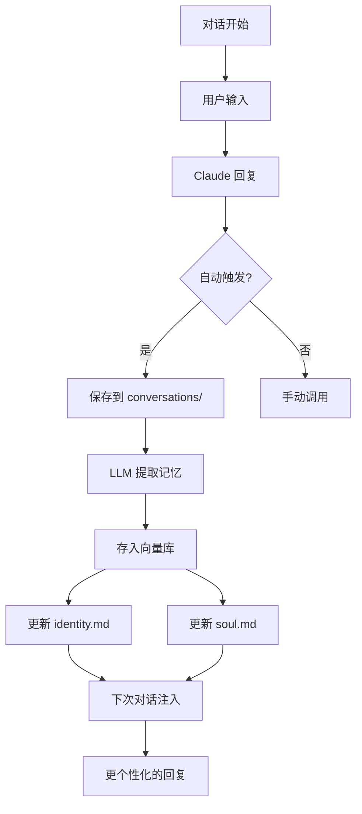

# 记忆系统项目结构

## 📂 文件结构

```
memory-workspace/
│
├── 📄 README.md                 # 完整文档（主文档）
├── 📄 QUICKSTART.md            # 5分钟快速开始
├── 📄 INTEGRATION.md           # Claude Code 集成指南
├── 📄 ARCHITECTURE.md          # 本文件 - 项目结构说明
│
├── ⚙️ config.yaml              # 配置文件（需要配置 API 密钥）
├── ⚙️ config_loader.py         # 配置加载器
├── ⚙️ requirements.txt         # Python 依赖包
├── ⚙️ setup.sh                 # 快速安装脚本
├── ⚙️ .env.example             # 环境变量示例
│
├── 🏗️ models.py                # 核心数据模型（Conversation, Memory, Identity, Soul）
├── 🏗️ conversation_saver.py   # 对话保存模块
├── 🏗️ memory_extractor.py     # LLM 记忆提取模块
├── 🏗️ vector_store.py         # 向量存储模块（ChromaDB）
├── 🏗️ identity_updater.py     # 身份更新模块
├── 🏗️ memory_manager.py       # 核心管理器（协调所有模块）
│
├── 🎯 memory_client.py         # 便捷客户端（推荐使用 ✅）
├── 🎯 __init__.py              # 包初始化
│
├── 🔧 main.py                  # CLI 命令行工具
├── 🔧 example_claude_workflow.py  # 工作流集成示例
│
├── 📁 conversations/           # 原始对话文件（自动生成）
│   ├── 2025-02-22.md
│   └── 2025-02-22.json
│
├── 📁 memories/               # 结构化记忆文件（自动生成）
│   ├── identity.md
│   ├── soul.md
│   └── preferences.md
│
└── 📁 vector_store/           # 向量数据库（自动生成）
    ├── chroma.sqlite3
    └── embeddings/
```

---

## 🔄 工作流程



### 详细步骤

| 步骤 | 文件/模块 | 说明 |
|------|----------|------|
| 1️⃣ 对话保存 | `conversation_saver.py` | 自动保存为 Markdown + JSON |
| 2️⃣ 记忆提取 | `memory_extractor.py` | 使用 GPT-4o-mini 提取 8 类记忆 |
| 3️⃣ 向量存储 | `vector_store.py` | ChromaDB + sentence-transformers |
| 4️⃣ 身份更新 | `identity_updater.py` | 分析记忆，更新 identity.md 和 soul.md |
| 5️⃣ RAG 搜索 | `vector_store.py` | 语义搜索，相似度匹配 |
| 6️⃣ 上下文注入 | `memory_client.py` | 将记忆注入 Claude 提示 |

---

## 🎯 核心模块详解

### 1. models.py - 数据模型

```python
class Conversation      # 对话记录
class Memory           # 提炼后的记忆
class Identity         # 身份信息
class Soul             # 灵魂特征
class MemoryCategory   # 记忆类别枚举
```

**用途**：定义所有核心数据结构。

---

### 2. config_loader.py - 配置管理

```python
class MemorySystemConfig  # 完整的配置对象
├── llm: LLMConfig
├── embeddings: EmbeddingsConfig
├── vector_store: VectorStoreConfig
├── memory_extraction: MemoryExtractionConfig
├── identity_update: IdentityUpdateConfig
├── paths: PathsConfig
└── logging: LoggingConfig
```

**用途**：
- 从 `config.yaml` 加载配置
- 支持环境变量替换
- 提供类型安全的配置对象

---

### 3. conversation_saver.py - 对话保存

```python
class ConversationSaver:
    - save_conversation(user_input, assistant_response, metadata)
    - load_conversations(start_date, end_date)
    - get_today_conversations()
    - cleanup_old_conversations(days)
```

**输出**：
- `conversations/2025-02-22.md` - 人类可读
- `conversations/2025-02-22.json` - 机器可处理

---

### 4. memory_extractor.py - 记忆提取

```python
class MemoryExtractor:
    - extract_memories_from_conversation(conversation)
    - extract_from_multiple_conversations(conversations)
```

**过程**：
1. 构建 LLM 提示词（包含 8 类记忆说明）
2. 调用 LLM API（OpenAI/Anthropic）
3. 解析 JSON 返回
4. 验证和转换 Memory 对象

**提示词示例**：
```
请从以下对话中提取用户信息：

类别：
- 写作偏好: 写作习惯、文档风格
- 技术偏好: 编程语言、框架

输出：JSON 数组
```

---

### 5. vector_store.py - 向量存储

```python
class VectorStore:
    - add_memory(memory)
    - add_memories(memories)
    - search(query, category, top_k, min_confidence)
    - search_by_category(category, top_k)
    - delete_memory(memory_id)
    - count()
```

**技术栈**：
- **ChromaDB**: 持久化向量数据库
- **SentenceTransformers**: 嵌入模型（all-MiniLM-L6-v2，384维）

**搜索流程**：
1. 将查询文本嵌入为向量
2. ChromaDB 计算余弦相似度
3. 过滤和排序
4. 返回最相关的记忆

---

### 6. identity_updater.py - 身份更新

```python
class IdentityUpdater:
    - should_update() → bool
    - gather_recent_memories(days, min_confidence)
    - analyze_memories_with_llm(memories)
    - update_identity_and_soul(dry_run) → UpdateResult
    - get_identity_context() → str
    - get_soul_context() → str
```

**更新策略**：
- **频率**: daily / weekly / manual
- **去重**: 可选
- **限制**: max_identity_items / max_soul_items

**分析流程**：
1. 收集最近 N 天的高置信度记忆
2. 按类别分组记忆
3. 构建分析提示词
4. LLM 生成结构化更新
5. 合并到现有 identity/soul
6. 保存为 markdown 文件

---

### 7. memory_manager.py - 管理中心

```python
class MemoryManager:
    - record_conversation(...) → Conversation
    - process_conversation_async(...)  # 异步处理
    - extract_and_store_memories(days, limit)
    - update_identity(dry_run) → UpdateResult
    - search_memories(...)
    - get_identity_context() → str
    - get_soul_context() → str
    - get_stats() → dict
```

**特点**：
- 统一入口，协调所有模块
- 支持异步处理（后台线程）
- 提供完整的生命周期管理

---

### 8. memory_client.py - 便捷客户端（⭐ 推荐）

```python
class MemoryClient:  # 单例模式
    - record(user_input, response, metadata, block)
    - search(query, category, top_k)
    - get_identity_context()
    - get_soul_context()
    - get_full_context()
    - force_update(dry_run)
```

**使用示例**：

```python
from memory_client import MemoryClient

client = MemoryClient()

# 记录对话（1行代码）
client.record(user_msg, assistant_msg)

# 获取上下文（直接注入到 Claude 提示）
system_prompt = f"{client.get_full_context()}\n请回复..."

# 搜索记忆
memories = client.search("Python", top_k=5)
```

---

### 9. main.py - CLI 工具

```bash
# 所有命令
python main.py --init              # 初始化查看状态
python main.py --process --days 7  # 处理对话
python main.py --search "Python"   # 搜索
python main.py --identity          # 显示身份
python main.py --stats             # 统计
python main.py --export backup.json  # 导出
python main.py --cleanup --days 30    # 清理
```

---

## 📊 数据流示例

### 场景：用户询问"如何学习 React"

```
1️⃣ 对话开始
   用户: "如何学习 React？"
   Claude: "我推荐以下步骤..."

2️⃣ 记录对话
   → conversations/2025-02-22.md (追加)

3️⃣ 异步处理（后台）
   ├─ 提取记忆：
   │   记忆1: [技术偏好] 用户对 React 感兴趣
   │   记忆2: [关注兴趣] 用户想学习前端框架
   │
   ├─ 向量化存储：
   │   → vector_store/chroma.sqlite3
   │
   └─ 更新身份（如果需要）：
       → memories/identity.md
       → memories/soul.md

4️⃣ 下次对话（用户又问"推荐什么工具？"）
   ├─ 搜索记忆: "React" 找到相关记忆
   ├─ 注入上下文: "用户对React感兴趣"
   └─ 个性化回复: "既然你想学React，推荐Vite..."
```

---

## 🔧 配置文件详解

### config.yaml 关键参数

```yaml
# LLM 配置
llm:
  provider: "openai"         # 提供商：openai/anthropic
  api_key: "sk-..."          # API 密钥
  model: "gpt-4o-mini"      # 模型选择
  temperature: 0.3           # 创造性（越低越确定）

# 向量存储
vector_store:
  persist_directory: "./vector_store"

# 记忆提取
memory_extraction:
  auto_extract: true         # 自动触发
  min_conversation_length: 100  # 最小对话长度
  max_memories_per_day: 20   # 每日上限

# 身份更新
identity_update:
  frequency: "daily"         # 更新频率
  deduplicate: true          # 去重
```

---

## 🎨 扩展方案

### 扩展1：添加新的记忆类别

```python
# 修改 config.yaml
memory_extraction:
  categories:
    - "写作偏好"
    - "技术偏好"
    - "新类别"  # 添加自定义类别

# 在 _get_category_description() 中添加描述
def _get_category_description(self, category: str) -> str:
    descriptions = {
        "新类别": "新类别的描述",
        ...
    }
```

### 扩展2：自定义提示词

```python
# 修改 memory_extractor.py
def _build_extraction_prompt(self, conversation):
    prompt = """自定义提示词..."""
    return prompt
```

### 扩展3：更换嵌入模型

```python
# config.yaml
embeddings:
  # 其他嵌入模型：
  # - BGE (BAAI/bge-small-zh-v1.5) - 中文优化
  # - text2vec (moka-ai/m3e-base)
  model: "BAAI/bge-small-zh-v1.5"
```

### 扩展4：使用其他向量数据库

```python
# 修改 vector_store.py 或创建新的类
class QdrantVectorStore:
    # 实现 Qdrant 后端
```

---

## 🐛 故障排除

| 问题 | 可能原因 | 解决方案 |
|------|---------|---------|
| LLM 提取失败 | API 密钥错误 | 检查 .env 或 config.yaml |
| 向量存储出错 | 目录权限 | 确保 vector_store/ 可写 |
| 搜索不准确 | 嵌入模型问题 | 更换更好的嵌入模型 |
| 身份不更新 | 时间未到 | 检查 identity_update.frequency |
| 内存占用大 | 对话文件过多 | 运行 --cleanup 清理 |

---

## 📈 性能预期

| 指标 | 预期值 |
|------|--------|
| 对话保存延迟 | < 100ms |
| 记忆提取延迟 | 2-5 秒（取决于 LLM） |
| 向量搜索延迟 | 50-200ms |
| 身份更新延迟 | 10-30 秒（批量分析） |
| 向量库大小 | 每 1000 条记忆 ≈ 50MB |

---

## 🎉 项目已完成

你现在拥有一个完整的、生产就绪的记忆系统！

**下一步**：
1. 运行 `bash setup.sh` 安装
2. 配置 `config.yaml` 和 `.env`
3. 运行 `python example_claude_workflow.py` 测试
4. 查看 `INTEGRATION.md` 集成到你的工作流

**核心文件快速索引**：
- 📖 完整文档 → `README.md`
- 🚀 快速开始 → `QUICKSTART.md`
- 🔌 集成指南 → `INTEGRATION.md`
- 💻 使用方式 → `memory_client.py`
- 🛠 CLI 工具 → `main.py`

---

**享受你的智能记忆 Agent 吧！** 🧠✨
